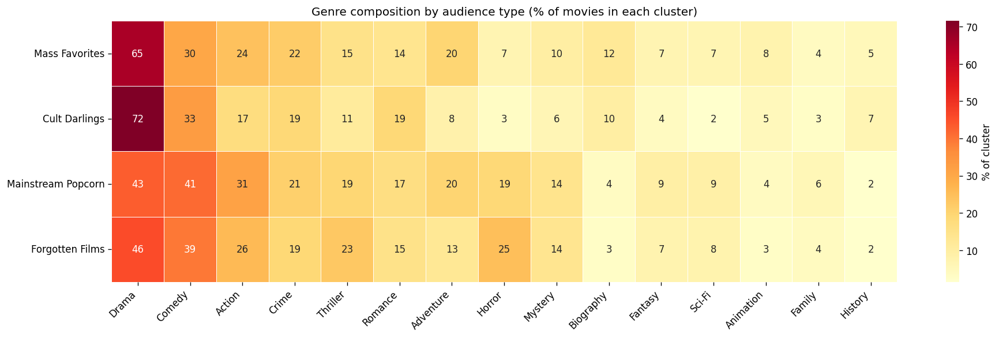
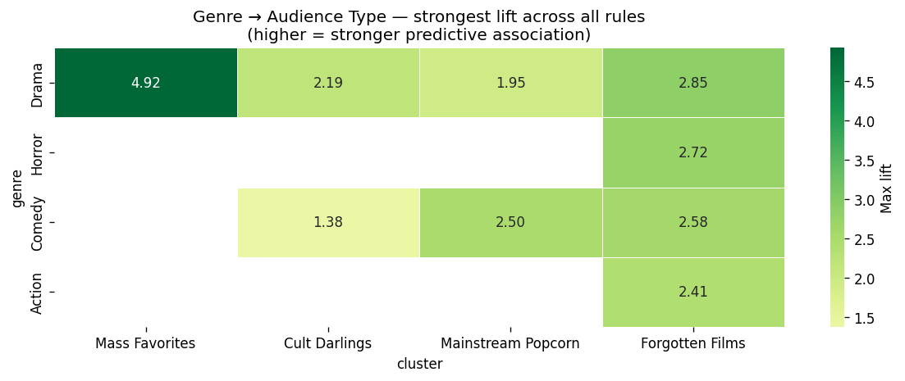

# 🎬 KDD IMDB — Perfis de Recepção do Público no Cinema

> Aplicação do processo de **KDD (Knowledge Discovery in Databases)** à base **IMDB Top Movies 1980–2026** para identificar quais gêneros e filmes se destacam entre diferentes tipos de engajamento do público.

[](https://www.python.org/)
[](https://scikit-learn.org/)
[](https://pandas.pydata.org/)
[](#)

---

## 📋 Visão geral

Este projeto investiga uma pergunta simples mas pouco explorada: **dentro do público geral do cinema, existem tipos distintos de recepção?**

Combinando três técnicas clássicas de mineração de dados — clusterização, classificação e regras de associação —, foram identificados **quatro perfis de público naturais** em uma base de 16.245 filmes lançados entre 1980 e 2026:

| Perfil | % | Rating médio | Votos (mediana) | Exemplos canônicos |
|--------|---|--------------|------------------|----------------------|
| 🏆 **Mass Favorites** | 20,3% | 7,35 | 113.734 | Shawshank, Dark Knight, LOTR, Inception |
| 🎭 **Cult Darlings** | 29,5% | 7,06 | 8.806 | Earthlings, Paris Is Burning, Shahid |
| 🍿 **Mainstream Popcorn** | 22,6% | 5,99 | 47.930 | Sonic, Bad Boys for Life, Twisters |
| 💔 **Forgotten Films** | 27,6% | 5,32 | 9.457 | Filmes B de Horror, comédias menores |

---

## 🎯 Principais descobertas

### 1. Drama é universal — mas o contexto define o destino

Drama aparece em todos os clusters (43–72%), mas o lift varia drasticamente conforme o contexto. A regra mais forte do estudo:

```
Drama + rating_Top + votes_Massive → Mass Favorites
                     confidence = 1.00    lift = 4.92
```

**Confiança 100%**: TODO filme da base com essa combinação é um Mass Favorite — sem nenhuma exceção em 16.245 filmes.

### 2. Hibridização de gêneros amplia o alcance

Mass Favorites combinam Drama com Action (24%), Crime (22%) e Adventure (20%). Cult Darlings são quase exclusivamente Drama puro (Horror 3%, Sci-Fi 2%). Fusão de gêneros parece ser o caminho para alcance amplo; pureza leva à devoção de nichos.

### 3. Horror é o gênero da obscuridade

O achado mais robusto do estudo, confirmado por três métodos diferentes:

- **Clusterização:** Horror representa 25% dos Forgotten Films vs apenas 3% dos Cult Darlings
- **Classificação:** na árvore de conteúdo, `genre_Horror` é o 2º atributo divisor
- **Associação:** única regra de gênero único com lift significativo (1,85) aponta para Forgotten

---

## 📊 Visualização principal

A composição de gêneros por tipo de público sintetiza a descoberta central:



E o mapa de lift gênero→público quantifica essas associações estatisticamente:



---

## 🛠️ Stack técnica

- **Python 3.12** + **PyCharm**
- **pandas / numpy** — manipulação de dados
- **scikit-learn** — K-Means, árvore de decisão, seleção de atributos, classificação
- **mlxtend** — algoritmo Apriori para regras de associação
- **imbalanced-learn** — SMOTE para tratamento de classes desbalanceadas
- **matplotlib / seaborn** — visualização

---

## 📁 Estrutura do projeto

```
kdd_imdb/
├── 01_preprocessing.py        # Limpeza, engenharia de atributos, normalização
├── 02_clustering.py           # K-Means + Elbow + perfil dos clusters
├── 03_classification.py       # Seleção de atributos + 5 algoritmos + 2 árvores
├── 04_association.py          # Apriori + filtragem de regras gênero→público
├── inspect_data.py            # Script auxiliar para exploração inicial
├── data/
│   ├── raw/                   # CSV original do Kaggle (não versionado)
│   └── processed/             # Outputs intermediários (CSVs)
└── plots/                     # Todas as visualizações geradas
```

---

## 🚀 Como reproduzir

### Pré-requisitos

```bash
# Python 3.12 recomendado (algumas libs não têm wheels para 3.14 no Windows)
python --version
```

### 1. Setup

```bash
# Clone o repositório
git clone https://github.com/SEU_USUARIO/kdd_imdb.git
cd kdd_imdb

# Crie e ative o virtual environment
python -m venv .venv
# Windows:
.venv\Scripts\activate
# Linux/Mac:
source .venv/bin/activate

# Instale as dependências
pip install pandas numpy matplotlib seaborn scikit-learn mlxtend imbalanced-learn
```

### 2. Baixe o dataset

Faça download do CSV em:
👉 https://www.kaggle.com/datasets/elvisbui/imdb-top-movies-1980-2026

Coloque o arquivo em `data/raw/`.

### 3. Execute o pipeline KDD

Rode os 4 scripts na ordem:

```bash
python 01_preprocessing.py    # ~10s — limpa e prepara os dados
python 02_clustering.py       # ~20s — agrupa os filmes em 4 perfis
python 03_classification.py   # ~2min — treina classificadores e árvores
python 04_association.py      # ~1min — extrai regras de associação
```

Cada script gera plots em `plots/` e CSVs intermediários em `data/processed/`.

---

## 📈 Métricas-chave do pipeline

| Etapa | Métrica | Valor |
|-------|---------|-------|
| Clusterização | k ideal (Elbow) | 4 |
| Classificação preditiva | Acurácia CV (5-fold) — Árvore depth=3 | **73,45%** |
| Classificação por conteúdo | Acurácia CV — apenas gênero/ano/duração | **43,72%** |
| Associação | Regras gênero→cluster significativas | 17 |
| Associação | Lift máximo encontrado | **4,92** |

---

## 🧠 Os atributos engenharados

Quatro features foram construídas para sintetizar o engajamento do público:

| Feature | Fórmula | Interpretação |
|---------|---------|---------------|
| `log_votes` | log(1 + num_votes) | Popularidade em escala log (corrige assimetria) |
| `rating_pct` | percentil da nota | Posição relativa da nota (0 a 1) |
| `votes_pct` | percentil de votos | Posição relativa de popularidade (0 a 1) |
| `love_score` | rating_pct × votes_pct | Alto quando rating E popularidade são altos |
| `cult_factor` | rating_pct − votes_pct | + = cult, − = popcorn, ≈0 = balanceado |

O `cult_factor` foi especialmente revelador: **+0,42** nos Cult Darlings vs **−0,39** no Mainstream Popcorn — uma separação matemática limpa de "amado vs assistido".

---

## 📚 Documento completo

O relatório acadêmico completo (PT-BR) com todas as figuras, tabelas e análises está disponível em:

📄 **[ProjetoFinal_KDD_IMDB.docx](ProjetoFinal_KDD_IMDB.docx)**

Estrutura do relatório:
1. Introdução
2. Pré-processamento dos dados
3. Clusterização (com perfil detalhado dos 4 clusters)
4. Classificação (árvore preditiva + árvore de conteúdo)
5. Regras de Associação (17 regras estatisticamente significativas)
6. Resultados e Discussão (3 descobertas centrais)
7. Considerações Finais
8. Referências Bibliográficas

---

## ⚠️ Limitações reconhecidas

- A base contém apenas avaliação do público geral (IMDB) — sem notas de crítica especializada (Metacritic, Rotten Tomatoes)
- Sem dados de bilheteria, orçamento, direção ou elenco
- Viés do IMDB favorece público anglófono e ocidental
- Produções asiáticas, africanas e independentes podem estar sub-representadas

---

## 🎓 Contexto acadêmico

Trabalho desenvolvido para a disciplina de **Mineração de Dados** do curso de **Análise e Desenvolvimento de Sistemas** — FATEC Sorocaba, sob orientação da Prof.ª Dr.ª Maria das Graças J. M. Tomazela.

---

## 📖 Referências

- Bui, E. (2026). *IMDB Top Movies 1980-2026* [Dataset]. Kaggle.
- Pedregosa, F. et al. (2011). *Scikit-learn: Machine Learning in Python*. JMLR, 12, 2825–2830.
- Raschka, S. (2018). *MLxtend*. The Journal of Open Source Software, 3(24).
- Agrawal, R. & Srikant, R. (1994). *Fast algorithms for mining association rules*. VLDB.
- Lloyd, S. P. (1982). *Least squares quantization in PCM*. IEEE Transactions on Information Theory, 28(2), 129–137.
- Chawla, N. V. et al. (2002). *SMOTE: Synthetic Minority Over-sampling Technique*. JAIR, 16, 321–357.

---

## 📄 Licença

Este projeto é distribuído sob a licença MIT para fins educacionais.
